## ✨ Features

- **Universal IPDR Log Parser:** Handles multiple telecom log formats, auto-detects schema, and standardizes data for analysis.
- **Automated A→B Mapping:** Extracts and visualizes communication relationships as interactive graphs.
- **AI-Powered Anomaly Detection:** Uses ML models (CatBoost, neural networks) to flag suspicious sessions with confidence scores.
- **Investigator Dashboard:** Upload logs, view graphs, filter anomalies, and download reports in a user-friendly web interface.
- **Historical Analysis:** Stores all uploads and results for future reference and compliance.
- **Secure & Auditable:** All data is encrypted, with audit logs and role-based access control.
- **3D/2D Visualization:** Modern, interactive graph visualizations for deep investigation.


## 🖥️ Screenshots

<div align="center">
	
	<br/>
	<i>Interactive A→B Communication Graph</i>
</div>

<div align="center">
	
	<br/>
	<i>Anomaly Detection Results</i>
</div>


## 🏗️ Installation & Setup

### Prerequisites
- Python 3.9+
- Node.js 18+
- npm or pnpm

### Backend
```bash
cd backend
pip install -r requirements.txt
uvicorn app.main:app --reload
```

### Frontend
```bash
cd frontend
npm install
npm run dev
```


## 🤝 Contribution Guide

We welcome contributions! To get started:
1. Fork this repository
2. Create a new branch (`git checkout -b feature/your-feature`)
3. Commit your changes
4. Push to your fork and open a Pull Request

Please see [CONTRIBUTING.md](CONTRIBUTING.md) for more details.


## ❓ FAQ

**Q: What is IPDR?**
A: IPDR (IP Detail Record) is a log of internet protocol-based communication sessions generated by telecom providers.

**Q: Who can use this tool?**
A: Cybersecurity investigators, law enforcement, telecom security teams, and researchers.

**Q: Is my data secure?**
A: Yes, all uploaded data is encrypted and access is controlled by user roles.

**Q: Can I run this on my own infrastructure?**
A: Yes, follow the installation steps above to deploy locally or on your server.


## 📄 License

This project is licensed under the MIT License.

---


<div align="center">
	
	
	
	<br/>
	
	
</div>

#  IPDR Graph Engine

<div align="center">
<b>Automated, auditable pipeline to detect anomalous sessions and map A→B relationships from IPDR logs.</b>
</div>

<br/>

<div align="center">
	
</div>

---

---


## 🚩 Problem Statement

Telecoms generate massive IPDR data; manual analysis is overwhelming, inefficient, and inaccessible to non-technical stakeholders.

**Need:** Transform complex IPDR data into actionable intelligence with visual and AI tools.

---


## 💡 Proposed Solution

A web-based, investigator-first platform that ingests heterogeneous IPDR logs, normalizes the data, constructs A→B communication graphs, applies ML-based anomaly detection, and delivers interactive 3D/2D visualizations and auditable reports—all while securely storing IPDR data in encrypted storage.

---


## 🛠️ Solution Workflow

```mermaid
flowchart TD
	A[📥 Ingest / Upload] --> B[🧹 Parse & Normalize]
	B --> C[🔗 Graph Mapping]
	C --> D[🤖 ML Analysis]
	D --> E[📊 Visualization & Reporting]
	E --> F[🔒 Secure Storage]
```




---


## 🧩 Detailed Solution Explanation

- **Ingest / Upload:**
	- Drag-and-drop or CSV upload with automatic schema detection and data preview.
	- Supports large files and multiple formats (CSV, XLSX, TXT).
	- Real-time data preview and validation.
- **Parse & Normalize:**
	- Universal parser detects schema, extracts entities (IPs, phone numbers, session metadata), and standardizes data.
	- Handles missing values, inconsistent formats, and data cleaning.
	- Converts all logs to a unified internal schema for downstream processing.
- **Graph Mapping:**
	- Build node/edge graphs (A-party/B-party as nodes, sessions as edges).
	- Support for graph analytics (degree, centrality, clustering, shortest path, etc.).
	- Enables interactive exploration of communication patterns.
- **ML Analysis:**
	- ML models flag anomalous sessions and provide confidence scores.
	- Uses CatBoost, neural networks, and custom heuristics.
	- Results are explainable and auditable for investigators.
- **Visualization & Reporting:**
	- Interactive 3D/2D graph visualizations (WebGL, D3.js, React-Force-Graph).
	- Downloadable, auditable reports for investigators (PDF, CSV).
	- Dashboard for historical analysis and case management.
- **Secure Storage:**
	- All IPDR data is encrypted and securely stored for compliance and future analysis.
	- Role-based access control and audit logging.

---


## 🏆 Hackathon Context

- **Event:** CIIS Cyber Security Hackathon 2025
- **Organized by:** VIT Bhopal University
- **Team:** Team Brigade (5 members)
- **Focus:** Mapping A→B relationships in IPDR logs, anomaly detection, and investigator-friendly analytics.

---


## 📦 Project Structure (Simplified)

```text
ipdr-graph-engine/
├── backend/    # FastAPI backend, ML models, data parsing
├── frontend/   # React/Next.js frontend, graph visualization
├── Anomoly/    # Notebooks, model artifacts
├── notebooks/  # Research and prototyping
└── scripts/    # Deployment and utility scripts
```

---


## 🚀 Quick Start

```bash
# Backend
cd backend
pip install -r requirements.txt
uvicorn app.main:app --reload

# Frontend (in a new terminal)
cd frontend
npm install
npm run dev
```

---


## 🔗 Useful Links
- [Live Demo](https://ciis-hackathon.vercel.app/)
- [API Docs](https://ipdr-graph-engine.onrender.com/docs)

---


## 👥 Team

- **Team Brigade** (VIT Bhopal University)
		- 5 Members
		- Roles: Full Stack, ML, Data Engineering, UI/UX, DevOps

---


## 🛠️ Technology Stack

- **Backend:** FastAPI, Python, Scikit-learn, CatBoost, NetworkX, Pandas
- **Frontend:** React, Next.js, D3.js, React-Force-Graph, Tailwind CSS
- **Visualization:** WebGL, 3D/2D Graphs
- **Deployment:** Render (Backend), Vercel (Frontend)
- **Database:** Encrypted storage, role-based access

---


## 📚 Use Cases

- **Cybersecurity Investigations:**
		- Threat actor tracking, network forensics, incident response
- **Law Enforcement:**
		- Digital evidence analysis, pattern recognition, timeline reconstruction
- **Telecommunications Security:**
		- Network abuse detection, fraud investigation, compliance monitoring

---


## 🏅 Achievements

- Automatic A→B party extraction from heterogeneous IPDR logs
- Investigator-friendly dashboard with comprehensive visualizations
- Scalable, auditable, and privacy-compliant architecture
- Real-time anomaly detection with confidence scoring
- Complete end-to-end investigation workflow

---


<div align="center">
	
	<br/>
	<b>Built with passion for cybersecurity and digital forensics.</b>
</div>